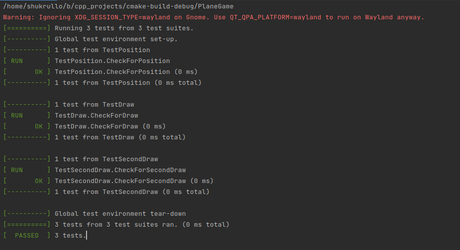

## PlaneGame

### Description

A game which is written in C++ and Qt.

It's a war plane game which you will try to kill as many enemies as you can

### Requirements:
  + Cmake
  + Qt creator

### First you should clone the repository.

If you don't have Qt installed then do this job, otherwise you can just go to the next paragraph

### Linux Qt Creator Installation
  + Open a terminal (Ctrl + Alt + t in Ubuntu)
  + Copy the following code into the terminal and hit enter:
  ```
  sudo apt install qtcreator
  ```
  ```
  sudo apt install build-essential
  ```
  ```
  sudo apt install qt5-default
  ```

### Then open the terminal, copy and paste following commands:
  ```
  cd cpp_projects
  ```
  ```
  cmake .
  ```
  ```
  make
  ```
### And lastly run the project:
  ```
  ./PlaneGame
  ```

Some tests are created:\
  <br>
  
  <br>
